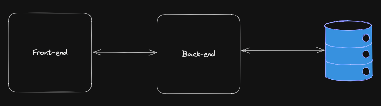

# Boas-vindas ao repositório do Projeto Recipes App Full Stack

Para realizar o projeto, atente-se a cada passo descrito a seguir, e se tiver qualquer dúvida, nos envie por _Slack_! #vqv 🚀

Aqui você vai encontrar os detalhes de como estruturar o desenvolvimento do seu projeto a partir deste repositório, utilizando uma branch específica e um _Pull Request_ para colocar seus códigos.

## Termos e acordos

Ao iniciar este projeto, você concorda com as diretrizes do Código de Conduta e do Manual da Pessoa Estudante da Trybe.

# Entregáveis

<details>
  <summary><strong>🤷🏽‍♀️ Como entregar</strong></summary>

- **Cada grupo terá uma branch específica** no formato `main-group-X`. Ex: `main-group-1`; `main-group-2`; etc;

- **Para entregar o seu projeto você deverá criar um `Pull Request` base neste repositório no formato `[MAIN GROUP X] [BASE]`**. Seu `Pull Request` deve apontar da branch `main-group-X` para a branch `main` (que será sua PR principal) e deve agregar todo o trabalho do seu grupo para avaliação no final do desenvolvimento;

- **Cada feature/fix/etc deve ser desenvolvida em uma nova branch**, cujo formato preferencialmente deve ser `main-group-X-<alteração>-<especificação>`. Ex: `main-group-1-feat-login-form`. Isso ajudará tanto o seu time quanto a equipe de instrução a localizar seus trabalhos no projeto;

- **No término do projeto, cada feature/fix/etc deve ser mergeada _(preferencialmente via PR, com code review e aprovação de todo o grupo)_ com a branch principal do grupo**, onde ocorrerá a avaliação. Ex: `main-group-1-feat-login-form` deve ser mergeado com `main-group-1`;

- **Cada PR deve, preferencialmente, ter o título no formato `[MAIN GROUP X] [CONTEXTO] [ALTERAÇÃO] [DESCRIÇÃO]`**. Ex: `[MAIN GROUP 1] [API] [FEAT] [LOGIN]`; `[MAIN GROUP 1] [FRONT] [FEAT] [LOGIN-FORM]`; etc. Isso ajudará tanto o seu time quanto a equipe de instrução a localizar seus trabalhos no projeto.

  > Lembre-se que você pode consultar nosso conteúdo sobre [Git & GitHub](https://app.betrybe.com/learn/course/5e938f69-6e32-43b3-9685-c936530fd326/module/fc998c60-386e-46bc-83ca-4269beb17e17/section/fe827a71-3222-4b4d-a66f-ed98e09961af/day/35e03d5e-6341-4a8c-84d1-b4308b2887ef/lesson/573db55d-f451-455d-bdb5-66545668f436) e nosso [Blog - Git & GitHub](https://blog.betrybe.com/tecnologia/git-e-github/) sempre que precisar!


  <br />
</details>

<details id="desenvolvido">
  <summary><strong>👨‍💻 O que deverá ser desenvolvido</strong></summary>

Nessa aplicação, seu grupo será responsável por criar um back-end e integrá-lo ao front-end do projeto App de Receitas 🍽.

Este projeto não é apenas codar, explorando toda sua habilidade em _hard skills_ e de seu grupo! Mas também é trabalhar em equipe, realizar discussões, fazer escolhas, estudar novas tecnologias, aprender e se divertir muito!

---

#### App de Receitas versão back-end...

> _Como será que deve ser feito o back-end daquela aplicação que desenvolvemos no final do módulo de front-end(nosso querido Recipes App)!?🤔_

Pois é, nosso app de receitas cresceu 🤩!!! Agora precisamos investir nele e prover nossos próprios dados, pois estamos consumindo APIs externas que os detém.

Em aproximadamente três meses, nosso app teve um crescimento exponencial! Isso nos gerou mais caixa e também mais problemas 🥲 Hoje em dia temos alguns gargalos e muito do que queremos, se quisermos algo personalizado, temos que pagar muito mais por isso. Mediante a estas circunstâncias, decidimos contratar seu time para continuar desenvolvendo aplicação e queremos o serviço em algumas etapas:

- Nosso app não pode parar, pois tempo é dinheiro!!! Portanto, para iniciar, 
vamos apenas trazer todas as requisições a APIs de terceiros para dentro da nossa infra! Com isso, nosso front já pode conversar com nosso back sem mudanças bruscas;
  - Para fazer isso, já temos várias discussões e decisões a serem tomadas! Algumas delas podem ser: _Qual arquitetura iremos usar? Qual linguagem de programação vamos escrever nossa API? Quais tecnologias vamos usar no back-end? O que cada pessoa do time vai fazer?_ e muito mais...

- Um segundo momento, precisamos nos desligar das APIs de terceiros e prover nossos próprios dados! Agora precisamos modelar nosso banco e fazer nossa API ter conhecimento sobre ele.
  - Aqui temos mais um monte de discussões: _Qual tipo de banco de dados usar(relacional ou não relacional)? Qual banco usar(MongoDB, MySQL, Cassandra, PostgreSQL...)?_

- Ao final precisamos fazer o deploy de nossa API, correto!? Então bora realizar mais esta atividade dentro do nosso processo de criar uma aplicação full stack 🚀

  <br />
</details>

<details>
<summary><strong> ⚓ Estrutura do projeto</strong></summary><br />

O projeto é composto de 4 entidades importantes para sua estrutura:

1️⃣ **Docker:**
  - O `docker-compose` tem a responsabilidade de unir todos os serviços conteinerizados (back-end, front-end e database) e subir o projeto completo com o comando: `docker-compose up -d`;
  - Você **deve** iniciar configurando os arquivos `Dockerfile` corretamente, nas raízes do diretório `front-end` e `back-end`;
  - Depois, **deve** configurar o arquivo `docker-compose` corretamente, na raiz do projeto, para então inicializar a aplicação.


2️⃣ **Back-end:**
 - Será o ambiente que você realizará a maior parte das implementações exigidas.
 - Deve rodar na porta `3001`, pois o front-end faz requisições para ele nessa porta por padrão;
 - Sua aplicação deve ser inicializada a partir do arquivo `/app/backend/src/server.ts`;


3️⃣ **Front-end:**
  - O front vocês já fizeram, não é necessário realizar grandes modificações no mesmo. A única exceção será o arquivo Dockerfile que precisará ser configurado e o _fecth_ para a nova URL.
  - O front **deve** se comunica com serviço de back-end pela url `http://localhost:3001`, através dos endpoints que você deve construir nos requisitos.

4️⃣ **Banco de dados:**
  - Tem o papel de fornecer dados para o serviço de _backend_.
  - Você **deve** configurar um container docker no arquivo do docker-compose através de um serviço definido como `db`.

  <br />
</details>

<details>
  <summary><strong>🗓 Data de Entrega</strong></summary>

- Este projeto é em grupo;
- Serão `4` dias de projeto;
- Data de entrega para avaliação regular do projeto: `26/06/2023 - 23:59h`.

  </details>

 <br />

# Orientações

## Antes de começar a desenvolver

Leia essa parte atentamente, pois aqui você encontrará informações importantes para preparar corretamente o setup do projeto.

<details>
  <summary><strong> 🔰 Iniciando o projeto</strong></summary><br />

  1. Clone o repositório `Usar link SSH`

- Entre na pasta do repositório que você acabou de clonar:
  * `cd pasta-do-repositório`

  2. Instale as dependências [**Caso existam**]
  *`npm install`

  3. Crie uma branch a partir da branch `main`
 - Verifique se você está na branch `main`
  * Exemplo: `git branch`
- Se não estiver, mude para a branch `main`
  * Exemplo: `git checkout main`
- Agora crie uma branch à qual você vai submeter os `commits` do seu projeto

- Você deve criar uma branch no seguinte formato: `nome-de-usuario-nome-do-projeto`
  * Exemplo: `git checkout -b maria-sd-027-project-recipes-app-full-stack`

  4. Adicione as mudanças ao _stage_ do Git e faça um `commit`
- Verifique que as mudanças ainda não estão no _stage_
  * Exemplo: `git status` (deve aparecer listada a pasta _maria_ em vermelho)
- Adicione o novo arquivo ao _stage_ do Git
        * Exemplo:
          * `git add .` (adicionando todas as mudanças - _que estavam em vermelho_ - ao stage do Git)
          * `git status` (deve aparecer listado o arquivo _maria/README.md_ em verde)
- Faça o `commit` inicial
  * Exemplo:
          * `git commit -m 'iniciando o projeto x'` (fazendo o primeiro commit)
          * `git status` (deve aparecer uma mensagem tipo _nothing to commit_ )

  5. Adicione a sua branch com o novo `commit` ao repositório remoto
- Usando o exemplo anterior: `git push -u origin joaozinho-sd-027-project-recipes-app-full-stack`

  6. Crie um novo `Pull Request` _(PR)_
- Vá até a página de _Pull Requests_ do [repositório no GitHub](https://github.com/tryber/sd-027-project-recipes-app-full-stack/pulls)
- Clique no botão verde _"New pull request"_
- Clique na caixa de seleção _"Compare"_ e escolha a sua branch **com atenção**
- Clique no botão verde _"Create pull request"_
- Adicione uma descrição para o _Pull Request_ e clique no botão verde _"Create pull request"_
- Volte até a [página de _Pull Requests_ do repositório](https://github.com/tryber/sd-027-project-recipes-app-full-stack/pulls) e confira que o seu _Pull Request_ está criado

  <br />
</details>

<details>
  <summary><strong>🕵️ Linter</strong></summary><br />

Para garantir a qualidade do código, usaremos o [ESLint](https://eslint.org/) para fazer a sua análise estática.

Este projeto já vem com as dependências relacionadas ao _linter_ configuradas nos arquivos `package.json` nos seguintes caminhos:

- `sd-027-project-recipes-app-full-stack/app/backend/package.json`

Para rodar o `ESLint` em um projeto, basta executar o comando `npm install` dentro do projeto e depois `npm run lint`. Se a análise do `ESLint` encontrar problemas no seu código, tais problemas serão mostrados no seu terminal. Se não houver problema no seu código, nada será impresso no seu terminal.

Você também pode instalar o plugin do `ESLint` no `VSCode`: bastar ir em extensions e baixar o [plugin `ESLint`](https://marketplace.visualstudio.com/items?itemName=dbaeumer.vscode-eslint).

⚠️**Atenção:** Pull Requests com issues de linter não serão avaliadas. Atente-se para resolvê-las antes de finalizar o desenvolvimento.

  <br />
</details>

<details>
  <summary><strong> ⚠️ Configurações mínimas para execução do projeto</strong></summary><br />

Na sua máquina você deve ter:

 - Sistema Operacional Distribuição Unix
 - Node versão 16
 - Docker
 - Docker-compose versão >=1.29.2

➡️ O `node` deve ter versão igual ou superior à `16.14.0 LTS`:
  - Para instalar o nvm, [acesse esse link](https://github.com/nvm-sh/nvm#installing-and-updating);
  - Rode os comandos abaixo para instalar a versão correta de `node` e usá-la:
    - `nvm install 16.14 --lts`
    - `nvm use 16.14`
    - `nvm alias default 16.14`

➡️ O`docker-compose` deve ter versão igual ou superior à`ˆ1.29.2`:
  * Use esse [link de referência para realizar a instalação corretamente no ubuntu](https://app.betrybe.com/learn/course/5e938f69-6e32-43b3-9685-c936530fd326/module/94d0e996-1827-4fbc-bc24-c99fb592925b/section/5987fa2d-0d04-45b2-9d91-1c2ffce09862/day/2f1a5c4d-74b1-488a-8d9b-408682c93724/lesson/b883b81d-21f6-4b60-aa62-8508f6017ea0);
  * Acesse o [link da documentação oficial com passos para desinstalar](https://docs.docker.com/compose/install/#uninstallation) caso necessário.

➡️ O grupo deve escolher previamente o Recipe App de alguma pessoa integrante, para a partir dele, o back-end ser continuado...


  <br />
</details>

<details>
  <summary><strong>🐳 Configuração Docker</strong></summary>

⚠️ **Crie os arquivos dockerfile:**

  - Os diretórios `frontend/` e `backend/`, devem possuir o arquivo `Dockerfile` configurados corretamente para a aplicação começar a rodar. Sem essa etapa concluída o _docker-compose_ não irá funcionar.

⚠️ **Atenção:**

  - Seu projeto **deve** conter um arquivo `docker-compose.yml` configurado com os serviços necessários;
  - O arquivo `docker-compose.yml` também pode ser utilizado para executar a aplicação na sua máquina local;

  <br />
</details>

# Requisitos

Conforme descrito na seção "[O que deverá ser desenvolvido](#desenvolvido)", o projeto será progressivo...

1. ✅ Primeiro passo, realizar o Front-end;
2. 🆕 Segundo passo, trazer toda infra e comunicação com back-end de terceiros, para dentro de um back-end proprietário;
3. 🆕 Agora é interessante fazer uma pausa e Dockerizar nossas aplicações;
4. 🆕 Próximo passo, ter nosso próprio back-end com nosso banco de dados e prover nossos próprios dados;
5. 🆕 Por último, que tal fazer o deploy do back-end e do banco de dados!?

Para iniciar o segundo passo, comece escolhendo um Front-end para o grupo e o colocando dentro diretório do projeto! Isso pode gerar uma discussão inicial e dar um norte por onde o grupo pode começar.

No passo de "Dockerizar", é importante a criação dos arquivo Docker em locais corretos. Na raiz do projeto, deve-se ter um arquivo `docker-compose.yml` e de largada dois serviços (_backend_ e _frontend_). Por fim, dentro de cada diretório, deve-se ter um arquivo `Dockerfile` e este também, deve estar configurado corretamente.

Uma dica final é, seguir os passos de criação parecidos com que foi realizado no TFC (Trybe Futebol Clube)... Abaixo tem algumas especificações para criação dos requisitos.

```tree
.
├── back-end/
│   ├── src/
│   │   ├── controllers
│   │   ├── routes
│   │   ├── service
│   │   ├── app.js
│   │   └── server.js
│   ├── .dockerignore
│   ├── Dockerfile
│   ├── package-lock.json
│   └── package.json
├── front-end
├── docker-compose.yml
└── README.md
```

## 01 - Primeiros passos para criação um back-end para o projeto `Recipes App`

A primeiro momento vamos continuar consumindo as APIs, porém através de um back-end criado pela nossa empresa. O diagrama a seguir traz uma visão geral de como deve ficar nosso back-end, ou seja, iremos criar uma aplicação back-end que apenas irá redirecionar as requisições vindo do front-end para as APIs externas. Com isso, nosso primeiro passo estará concluído, teremos um front-end que se intregar com o nosso back-end próprio, assim, controlamos o que enviamos para nosso front-end.


Lembre que as APIs externas utilizadas no front-end foram essas:
- [The Meal DB](https://www.themealdb.com/api.php);
- [The Cocktail DB](https://www.thecocktaildb.com/api.php);

O back-end deve responder nas seguintes URLs base:
- `http://localhost:3001/meals`
- `http://localhost:3001/drinks`

<details>
  <summary><strong>Observações técnicas</strong></summary>

  - Os endpoints de _meals_ e _cocktail_ presentes na documentação da API, devem respeitar os **novos endpoints** descritos na tabela abaixo:

  | Descrição                        | Novo Endpoint no Back-end    | Meals | Cocktail |
  |----------------------------------|------------------------------|-------|----------|
  | Buscar todos os nomes            | /name?q=                     | ✅     | ✅        |
  | Buscar por um nome em específico | /name?q=Arrabiata            | ✅     | ✅        |
  | Buscar por primeira letra        | /letter?q=a                  | ✅     | ✅        |
  | Buscar por aleatoriedade         | /random                      | ✅     | ✅        |
  | Buscar todas as categorias       | /categories                  | ✅     | ✅        |
  | Buscar todas as áreas            | /areas                       | ✅     |  X         |
  | Buscar todos os ingredientes     | /ingredients                 | ✅     | ✅        |
  | Buscar por um ingrediente        | /ingredient?q=chicken_breast | ✅     | ✅        |
  | Buscar po uma categoria          | /category?q=Seafood          | ✅     | ✅        |
  | Buscar por uma área              | /area?q=Canadian             | ✅     |  X         |

  > Estes _endpoints_ são parecidos com os utilizados no projeto _Recipes App_, em front-end e podem ser visto na documentação da API, [The Meal DB](https://www.themealdb.com/api.php) e [The Cocktail DB](https://www.thecocktaildb.com/api.php).

  - O Back-end da aplicação deve estar dentro do diretório chamado: `backend`;
  - Arquivos de configuração como: `package.json`, `Dockerfile`, `.dockerignore` e etc.. devem ficar na raiz do diretório `backend`;
  - Estrutura de diretórios(`controllers`, `services` etc...) e arquivos como: `app`, `server`, ... devem ficar dentro do diretório `src` _(como demonstrado antes deste requisito)_;
  - O Front-end deve ter seu diretório denominado: `frontend`.
  - Não deve haver necessidade de alteração do front-end.
  - Discutam a melhor forma de criar os endpoints para reaproveitamento de código.

  <br />
</details>


## 02 - Dockerização das aplicações

Crie e configure os arquivos `Dockerfile` e `docker-compose.yml` de forma correta:
- Na raiz dos diretórios `backend` e `frontend` deve ter um arquivo `Dockerfile`;
- A raiz do projeto deve ter um arquivo `docker-compose.yml`;

<details>
  <summary><strong>Observações técnicas</strong></summary>

  - O projeto deve possuir dois arquivos `Dockerfile`, um na raiz do diretório `backend` e outro na raiz `frontend`;
  - Neste primeiro momento o arquivo `docker-compose.yml` deve conter dois serviços: `backend` e `frontend`.
    - `backend` deve expor a porta 3001;
    - `frontend` deve expor a porta 3000;

  <br />
</details>

## 03 - Criando o próprio banco de dados

Agora é hora de deixar sua aplicação com essa cara



Isso mesmo, seremos donos de tudo, e não precisamos mais consumir as APIs externas, pois nosso objetivo é armazenar os dados em um banco de dados mantido pela nossa empresa.

Mas vamos com calma, não precisamos migrar as duas APIs de uma vez, vamos nos concentrar na diagramação da API de Meals OU de Cocktails. Uma vez sua base de dados criada e populada (manualmente ou via seeders) precisamos refatorar o código para não consumir a API externa.

Para que isso seja possível, crie e configure o banco de dados/arquivos de forma correta:
- Crie diagramas e scripts para documentar a aplicação;
- Crie o arquivo de conexão com o banco de dados;
- Modifique sua aplicação para deixar de consumir a API de terceiros e comece a ler/gravar seus próprios dados.
- Cria a base de dados para apenas UMA API externa;

<details>
  <summary><strong>Observações técnicas</strong></summary>

  Agora é a hora de prover nossos próprios dados e criar nosso bancos de dados:
  - Diagrame o banco de dados;
  - Crie scripts de construção do banco de dados e de população do mesmo;
  - Crie o banco de dados proprietário da aplicação.
  - Dockerize seu banco de dados;

  <br />
</details>

## 04 - Faça o deploy do restante da aplicação

Faça o deploy do back-end e banco de dados da sua aplicação:
- Utilize o Railway ou outra plataforma que desejar para fazer o deploy;
- Faça o deploy do banco de dados;
- Utilize o GitHub Actions para facilitar seus deploys.


